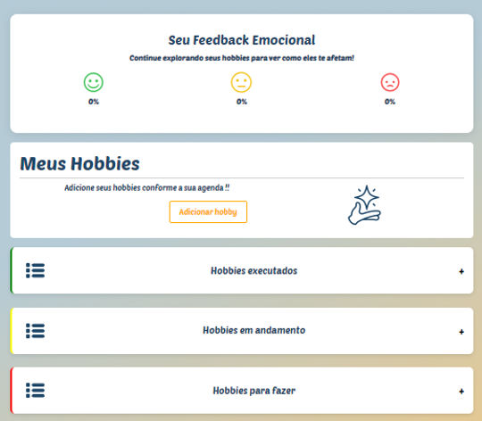

# Mercury - Gerenciador de Hobbies
Site desenvolvido para ajudar pessoas a gerenciar hobbies que podem contribuir no controle da ansiedade.

## 📸 Capturas de Tela

## 🚀 Como Executar o Projeto
### Pré-requisitos:
- **PHP** (versão 8.x)
- **MySQL** (para o banco de dados)
- **Xampp** (versão 8.3.12)

### Instruções para o back-end:  
- banco de dados com o nome 'mercury'
- administrador com senha 123

### Instruções para o front-end:
-abra o arquivo index.html no navegador

## 👩‍💻 Autores
Este projeto foi desenvolvido por:

- **Adrielly de Paula Pereira**:
  - Responsavel pela prototipação das telas
  - elaboração do diário existente no projeto
  
- **Clara Lima Viana**:
  - Criação do banco de dados e integração com o back-end.
  - Estilização do layout e elaboração de gráficos interativos.
  - Implementação de funcionalidades de gerenciamento de hobbies.

- **Gabrielle Confessone Drumond**:
  - Desenvolvimento back-end (PHP, integração com banco de dados MySQL).

## 📝 Como Citar
ADRIELLY de Paula Pereira, CLARA Lima Viana, GABRIELLE Confessone Drumond. Mercury: Gerenciador de Hobbies. 2024. Disponível em: https://github.com/ClaraVianaa/ProjetoMercury/blob/main/README.md . Acesso em: 26 nov. 2024.

## 📚 Artigo

## 📚 Apêndice
Para mais detalhes, consulte o [Apêndice do projeto](APENDICE.pdf).

## 📚 Pratica 
Para consultar o projeto, acesse [Projeto](websiteTCCconjuntovNova.rar).

